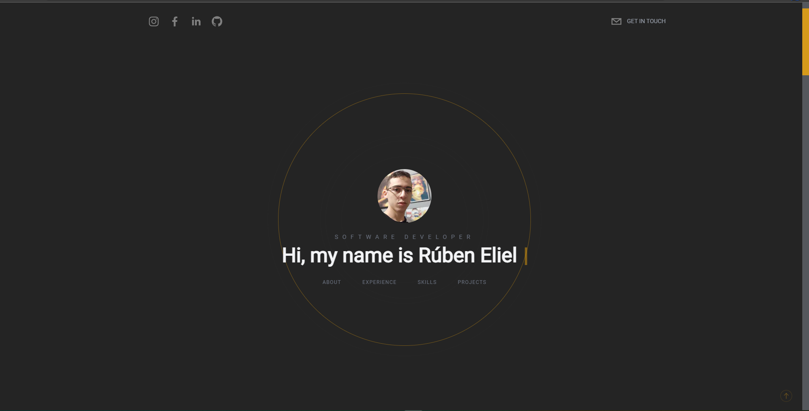

# 💻 Meu Portfólio

Este é o meu portfólio, nele estão reunidos todas as minhas experiências, habilidades e principais projetos. O projeto foi feito com NextJS e é totalmente responsivo. O projeto também está integrado com Sanity, dessa forma é possível adicionar e atualizar todos os conteúdos do portfólio através de um painel de admnistrador.

<h4 align="center"> 
	🚧  Next JS  🚀 Concluído...  🚧
</h4>

## 🎨 Preview

### 

## Tecnologias

- NextJS
- Typescript
- JSX
- Tailwind CSS
- Yarn - Package Manager
- Sanity
- Next Sanity
- Phosphor React
- Framer Motion
- React Simply Carousel
- React Social Icons
