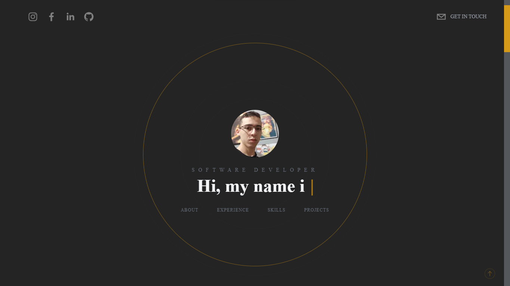

## Ignite Lab Event Platform

Este é o meu portfólio, nele estão reunidos todas as minhas experiências, skills e meus melhores projetos. O projeto foi feito com NextJS e é totalmente responsivo, então sinta-se a vontade para me conhecer mais um pouco através de qualquer aparelho que se conecte a internet. O projeto também é integrado com Sanity onde é possível adicionar e atualizar todos os conteúdos do portfólio através de um painel de controle.

### Preview

[Clique Aqui](https://my-portfolio-nine-zeta-94.vercel.app/#hero)

### Tecnologias

- NextJS
- Typescript
- JSX
- Tailwind CSS
- Yarn - Package Manager
- Sanity
- Next Sanity
- Phosphor React
- Framer Motion
- React Simply Carousel
- React Social Icons
